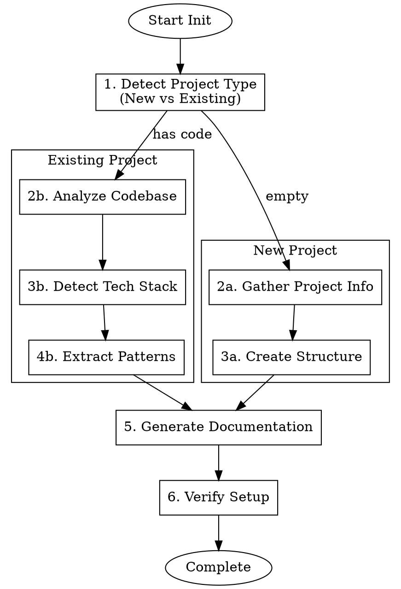

# DDAD-Init - Intelligent Project Documentation Generator

## Overview

Initialize or enhance projects with Claude Code team collaboration infrastructure. Supports both:
- **New Projects**: Creates `.claude/` directory with team rules and `docs/` structure
- **Existing Projects**: Analyzes codebase, detects tech stack, and generates tailored documentation

## When to Use

- Starting a new project that will use Claude Code
- Onboarding an existing codebase for AI-assisted development
- Analyzing a project to generate project-specific documentation
- Setting up team collaboration standards for a repository
- Need consistent project structure across multiple projects

## Quick Reference

| Mode | Description |
|------|-------------|
| **New Project** | Creates standard structure with customizable templates |
| **Existing Project** | Analyzes codebase and generates tailored documentation |

## Core Workflow



## Supported Tech Stacks

### Auto-Detection

| Language | Detection Files | Frameworks Detected |
|----------|-----------------|---------------------|
| **Go** | `go.mod`, `go.sum` | Gin, Echo, Fiber, Chi |
| **Node.js** | `package.json` | Express, Fastify, NestJS, Next.js |
| **Python** | `requirements.txt`, `setup.py`, `pyproject.toml` | Flask, Django, FastAPI |
| **Rust** | `Cargo.toml` | Actix, Axum, Rocket |
| **Java** | `pom.xml`, `build.gradle` | Spring Boot, Quarkus |

### Storage Layer Detection

| Storage | Detection Method |
|---------|------------------|
| **Redis** | Dependency + import patterns |
| **PostgreSQL** | Dependency + connection strings |
| **MongoDB** | Dependency + collection patterns |
| **ClickHouse** | Dependency + query patterns |
| **MinIO/S3** | Dependency + bucket operations |

## Implementation

### For New Projects

Run the init script with project parameters:

```bash
./init-project.sh -n "my-project" -t "api" -s "Go, PostgreSQL, Redis"
```

### For Existing Projects

Run the init script in an existing codebase directory:

```bash
cd /path/to/existing/project
~/.claude/skills/ddad-init/init-project.sh -n "project-name"
```

The script will:
1. Detect it's an existing project (has source files)
2. Scan for language indicators and dependencies
3. Analyze directory structure for architecture patterns
4. Extract code patterns and best practices
5. Generate tailored documentation based on findings

## Output Structure

```
project/
├── .claude/
│   ├── CLAUDE.md              # Main entry (with detected tech stack)
│   ├── agents/                # Custom agents
│   ├── skills/                # Custom skills
│   ├── commands/              # Custom commands
│   └── logs/                  # Logs directory
└── docs/
    ├── README.md              # Documentation hub
    ├── 01_requirements/       # Requirements specs
    ├── 02_design/             # Design documents
    ├── 03_architecture/       # Architecture docs
    ├── 04_api/                # API documentation
    ├── 05_database/           # Database schemas
    ├── 06_development/        # Development guides
    ├── 07_testing/            # Testing guides
    ├── 08_deployment/         # Deployment guides
    ├── 09_project/            # Project management
    └── assets/                # Documentation assets
```

## Customization Options

### Command Line Options

| Option | Description |
|--------|-------------|
| `-n, --name` | Project name (required) |
| `-t, --type` | Project type (application, api, library, cli) |
| `-s, --stack` | Technology stack (auto-detected if not provided) |
| `-z, --team-size` | Team size (Small, Medium, Large) |
| `-d, --directory` | Target directory (default: current) |
| `-a, --analyze` | Force analysis mode for existing projects |

### By Project Type

**Web Application**:
- Focus on frontend/backend separation
- Include deployment workflows
- Add security guidelines

**API Service**:
- Emphasize API standards
- Include versioning strategy
- Add OpenAPI documentation

**Library/Package**:
- Focus on public API design
- Include versioning/changelog
- Add contribution guidelines

## Integration Notes

- Works with existing `.claude/` configurations (preserves existing files)
- Preserves any existing documentation
- Complements SuperClaude framework if present
- Compatible with standard git workflows
- Supports bilingual documentation (English/Chinese) based on existing docs
